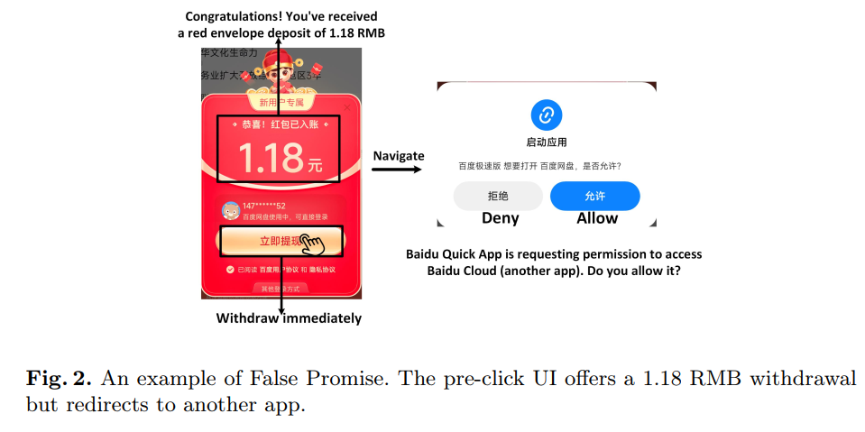
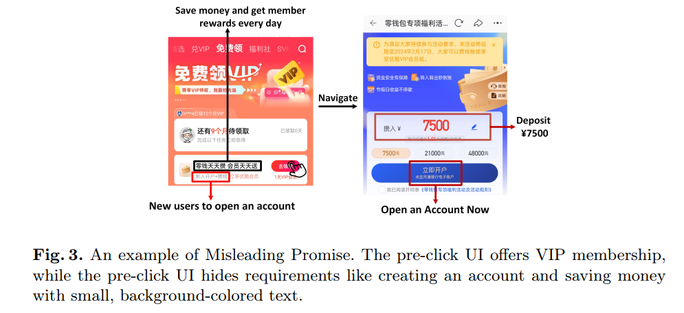

# Why Biting the Bait? Understanding Bait and Switch UI Dark Patterns in Mobile Apps


**BaitHunter** is a general analytical framework designed to detect **Bait and Switch (BnS)** dark patterns in mobile application interfaces. BnS is a manipulative tactic where apps attract users with appealing "bait" (e.g., low-cost offers), only to switch to misleading or harmful content (e.g., data collection prompts or unexpected charges).

> 🚨 Bait and Switch dark patterns threaten user **autonomy**, **privacy**, annd **financial safety**.

### 📸 Examples of Bait and Switch Dark Patterns

**Example 1: An example of Bait and Switch pattern**  


**Example 2: False Promise as Baits**  


**Example 3: Misleading Promise as Baits**  

---

## 🔍 What is BaitHunter?

**BaitHunter** identifies and analyzes Bait-and-Switch instances by detecting **semantic inconsistencies** between the initial UI (bait) and the subsequent content (switch). It combines:

- UI-Collector: Automatically traverse to collect the context of interface clicks in mobile applications.
- OCR: Extract features of interface context through improved OCR.
- UI-Element-Group: Aggregate user-clicked elements based on computer vision (CV) to extract user-click purposes.
- LLM-Classifier: Analyze the inconsistency of interface context information based on LLM and output classification results.

---

## 📂 Repository Overview

```text
BaitHunter/
├── data
│
├── UI-Collector/
│   ├── README.md
│   └── README_ch.md
│
├── OCR/
│   ├── README.md
│   └── README_ch.md
│
├── UI-Element-Group/
│   ├── README.md
│   └── README_ch.md
│
└── LLM-Classifier/
|   ├── README.md
|   └── README_ch.md
│
└── README.md
```

---

## 📚 Citation

Please cite the following paper in your publications if BaitHunter helps your research.

```bibtex
@inproceedings{bait2025hunter,
  title     = {Why Biting the Bait? Understanding Bait and Switch UI Dark Patterns in Mobile Apps},
  author   = {Lin, Yixi and Xu, Yue and Yao, Zitong and Nan, Yuhong and Kong, Queping and Wang, Xueqiang},
  booktitle = {2025 International Conference on Information and Communications Security (ICICS 2025)},
  year = {2025},
}
```